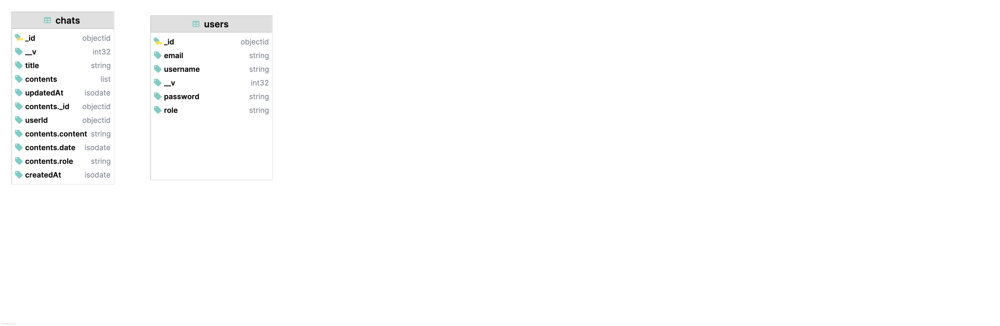

# Documentation Technique pour l'Application Chabotsio

## Introduction

Chabotsio est une application web de chatbot qui peut être exécutée localement sur votre machine. 
Elle utilise des modèles de langage fournis par Ollama pour générer des réponses. 
L'application est construite avec Express et Bun pour le backend, Vue.js pour le frontend, et MongoDB comme base de données.

## Prérequis

Avant de commencer, assurez-vous d'avoir les éléments suivants installés sur votre machine :

- [Node.js](https://nodejs.org/) (Version LTS récente)
- [Bun](https://bun.sh/)
- [MongoDB](https://www.mongodb.com/) (BDD)
- [Ollama](https://ollama.ai/) (pour les modèles de langage)

## Installation Frontend

``` szh
    git clone <url_depot> nom_dossier
    cd nom_dossier
    bun install
    bun dev
```


## Installation Ollama

- [Ollama models list](https://ollama.com/search)

``` szh
    ollama pull nom_du_model
```


## Installation Backend

``` szh
    git clone <url_depot> nom_dossier
    cd nom_dossier
    mv .env.example .env
    bun install
    bun dev
```

## Seeding

``` zsh
    # Create a user with admin privileges 
    bun db:seed:admin
    
    # Generate a 100 fake users 
    bun db:seed:users
```


## Contenu interface utilisateur

- Home : démarrer un nouveau chat ou acceder aux anciens chat, grace au tiroir
- Profile : modifier ses informations personelles

## Contenu interface admin

- Dashboard : listing des users, pagination et bar de recherche

## Structure Backend

``` zsh
    # ignore data if using mongo as Docker service
    tree -I "node_modules" -I "data"
    
├── README.md
├── bun.lockb
├── controllers
│   ├── adminController.ts
│   ├── authController.ts
│   ├── chatContoller.ts
│   ├── ollamaController.ts
│   └── userController.ts
├── database
│   ├── dbConnect.ts
│   └── seeders
│       ├── adminSeeder.ts
│       └── fakeUsersSeeder.ts
├── docker-compose.yml
├── http
│   ├── auth.http
│   ├── chat.http
│   └── ollama.http
├── index.ts
├── middlewares
│   ├── adminMiddleware.ts
│   ├── authMiddleware.ts
│   └── multer.ts
├── models
│   ├── chatModel.ts
│   └── userModel.ts
├── package.json
├── public
│   └── images
├── routes
│   ├── adminRoutes.ts
│   ├── authRoutes.ts
│   ├── chatroutes.ts
│   ├── ollamaRoutes.ts
│   └── userRoutes.ts
├── startup.bat
├── storage
│   └── logs
│       ├── combined.log
│       └── error.log
├── tests
│   ├── auth
│   │   ├── login.test.ts
│   │   └── register.test.ts
│   └── ollama
│       └── ollama.test.ts
├── tsconfig.json
├── utils
│   └── logger.ts
└── validators
    └── authvalidator.ts
```


## Backend Endpoints 

``` js

[
  {
    path: "/api/v1/ollama/show-models",
    methods: [ "GET" ],
    middlewares: [ "showModels" ],
  }, {
    path: "/api/v1/auth/register",
    methods: [ "POST" ],
    middlewares: [ "register" ],
  }, {
    path: "/api/v1/auth/login",
    methods: [ "POST" ],
    middlewares: [ "login" ],
  }, {
    path: "/api/v1/auth/me",
    methods: [ "GET" ],
    middlewares: [ "authMiddleware", "me" ],
  }, {
    path: "/api/v1/user/username/update",
    methods: [ "PUT" ],
    middlewares: [ "authMiddleware", "updateUsername" ],
  }, {
    path: "/api/v1/user/password/update",
    methods: [ "PUT" ],
    middlewares: [ "authMiddleware", "updatePassword" ],
  }, {
    path: "/api/v1/user/thumbnail/update",
    methods: [ "PUT" ],
    middlewares: [ "authMiddleware", "multerMiddleware", "updateProfileThumbnail" ],
  },
  {
    path: "/api/v1/chat",
    methods: [ "POST" ],
    middlewares: [ "authMiddleware", "chat" ],
  }, {
    path: "/api/v1/chat/history",
    methods: [ "GET" ],
    middlewares: [ "authMiddleware", "chatHistory" ],
  }, {
    path: "/api/v1/chat/last",
    methods: [ "GET" ],
    middlewares: [ "authMiddleware", "getLastChat" ],
  }, {
    path: "/api/v1/chat/delete/:id",
    methods: [ "DELETE" ],
    middlewares: [ "authMiddleware", "deleteChat" ],
  }, {
    path: "/api/v1/chat/:id",
    methods: [ "GET" ],
    middlewares: [ "authMiddleware", "chatById" ],
  }, {
    path: "/api/v1/admin/users",
    methods: [ "GET" ],
    middlewares: [ "authMiddleware", "adminMiddleware", "getUsersList" ],
  }, {
    path: "/api/v1/admin/users/:userId/delete",
    methods: [ "DELETE" ],
    middlewares: [ "authMiddleware", "adminMiddleware", "deleteUser" ],
  }
]
```


## MongoDB Diagram




## Structure Frontend


``` zsh
tree -I "node_modules"

├── README.md
├── bun.lockb
├── index.html
├── package.json
├── postcss.config.js
├── public
│   ├── drawer.png
│   └── vite.svg
├── src
│   ├── App.vue
│   ├── assets
│   │   └── vue.svg
│   ├── components
│   │   ├── Alert.vue
│   │   ├── Loading.vue
│   │   └── Navbar.vue
│   ├── main.ts
│   ├── pages
│   │   ├── Home.vue
│   │   ├── Login.vue
│   │   ├── Profile.vue
│   │   ├── Register.vue
│   │   └── admin
│   │       ├── Dashboard.vue
│   │       └── Login.vue
│   ├── router.ts
│   ├── style.css
│   ├── themes
│   │   └── index.ts
│   ├── types
│   │   └── index.ts
│   ├── utils
│   │   └── marked.ts
│   └── vite-env.d.ts
├── store
│   ├── authStore.ts
│   ├── modelStore.ts
│   ├── themeStore.ts
│   └── userStore.ts
├── tailwind.config.js
├── todo.md
├── tsconfig.json
├── tsconfig.node.json
└── vite.config.ts
```

## FrontEnd Endpoints

``` js
[
    {path : '/', component : Home, meta : {requiresAuth : true} },
    {path : '/profile', component : Profile, meta : {requiresAuth : true} },
    {path : '/login', component : Login,  meta : {requiresGuest : true} },
    {path : '/register', component : Register,  meta : {requiresGuest : true} },
    {path : '/chat/:id', component : Home,  meta : {requiresAuth : true}, name : "chat" },
    {path : '/admin/dashboard', component : Dashboard,  meta : {requiresAdmin : true} },
]
```


